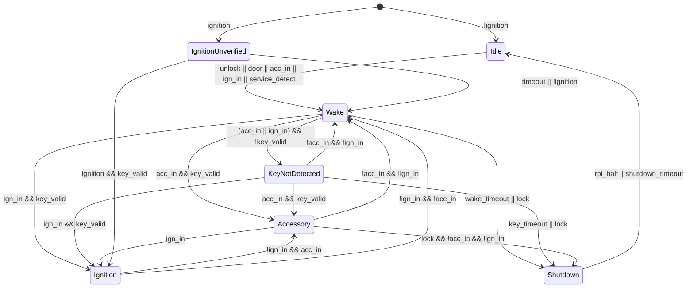

# AGENTS.md

## Project Overview

This repository contains the hardware, firmware, Raspberry Pi dash/logger software, CAN definitions, documentation, and shared libraries for a custom vehicle electronics system for a 2000 Mazda Miata street/track build.

The project is a high-end hobbyist vehicle electronics project, not a safety-certified automotive product. Designs should still use conservative engineering practices, fail-safe behavior, clear documentation, and maintainable code.

Major modules:

- `power_distribution_module/`
  - STM32-based PDM/body controller.
  - Handles vehicle power states, relay enables, selected high-side/low-side outputs, key authentication, Raspberry Pi dash/logger power sequencing, boost control, HVAC logic, window control, and alternator control.
- `display_logging_module/`
  - Raspberry Pi 5 based dash/logger.
  - Receives CAN data from the PDM, ECM, WCM, and other modules.
  - Receives VN300/VN-series INS data.
  - Displays dashboard screens and logs data.
- `engine_control_module/`
  - Engine-control-related notes and integrations.
  - Primary ECU is expected to be MicroSquirt/MegaSquirt-based.
- `wheel_control_module/`
  - Steering wheel button/CAN node.
  - Reads switches/buttons and broadcasts debounced button states over CAN.
- `shared/`
  - Shared CAN DBC files, firmware libraries, KiCad libraries, protocol definitions, signal definitions, and project-wide conventions.

## Repository Structure

```text
Vehicle-Electronics/
|-- README.md
|-- .gitignore
|-- AGENTS.md
|-- shared/
|   |-- miata.dbc
|   |-- readme.md
|   |-- KiCad-Libraries/
|   `-- Firmware-Libraries/
|-- power_distribution_module/
|   |-- HW/
|   `-- SW/
|-- display_logging_module/
|   |-- HW/
|   `-- SW/
|-- engine_control_module/
|   |-- HW/
|   `-- SW/
`-- wheel_control_module/
    |-- HW/
    `-- SW/
```

## General Instructions for Codex

When helping with this repository:

1. Prefer simple, readable, maintainable designs over clever ones.
2. Keep hardware, firmware, CAN definitions, and documentation synchronized.
3. Avoid changing public interfaces, CAN message layouts, connector pinouts, or state-machine behavior without explicitly documenting the change.
4. When modifying code, also update any relevant documentation, DBC files, signal definitions, and comments.
5. Do not assume the Raspberry Pi controls vehicle loads. The Raspberry Pi is a display/logger only.
6. The PDM owns vehicle power sequencing and body-control outputs.
7. The MicroSquirt/MegaSquirt ECU remains responsible for fuel and spark.
8. Prefer fail-safe defaults:
   - Boost solenoid off = wastegate spring boost.
   - Windows off on fault/reset.
   - Compressor off on fault/reset.
   - Noncritical outputs off on fault/reset.
   - Run-critical outputs may use short hardware hold-up during MCU reset, but should not remain latched indefinitely without a healthy controller.
9. Never add behavior that can command engine, boost, windows, or other vehicle outputs from the Raspberry Pi directly.
10. Any diagnostic or service feature should be explicitly separated from normal driving behavior.

## Coding Style

### C / C++ Firmware

Use clear embedded C or C++ suitable for STM32 firmware.

Preferred style:

- Explicit state machines.
- No hidden dynamic allocation in control loops.
- No blocking delays in main runtime logic.
- Use named constants for timing, thresholds, CAN IDs, ADC calibration, and output limits.
- Prefer deterministic update functions such as:

```c
Pdm_UpdateInputs();
Pdm_UpdateStateMachine();
Pdm_UpdateOutputs();
Pdm_UpdateCanTx();
Pdm_ProcessCanRx();
```

Use readable names:

```c
ign_in_active
acc_in_active
key_valid
rpi_shutdown_requested
boost_control_enabled
```

Avoid vague names:

```c
flag1
temp2
state_old
doThing()
```

### Python

Python is acceptable for:

- Raspberry Pi logging tools.
- CAN log decoding.
- VN300 data parsing.
- Dash development helpers.
- DBC/signal database generators.
- Offline analysis/replay tools.

Use:

- Type hints where practical.
- Clear module boundaries.
- No hardcoded absolute paths.
- Config files for CAN IDs, serial ports, and signal mappings.

### QML / Qt Dash UI

The dash UI should be component-based and able to run on a Windows development PC using fake or replayed data before being deployed to the Raspberry Pi.

Preferred structure:

```text
display_logging_module/SW/
`-- dash_ui/
    |-- qml/
    |   |-- MainDash.qml
    |   |-- components/
    |   |   |-- ArcGauge.qml
    |   |   |-- NumericReadout.qml
    |   |   |-- WarningLamp.qml
    |   |   `-- ShiftLightBar.qml
    |   `-- pages/
    |-- assets/
    |-- fake_data/
    `-- replay/
```

Reusable QML components should expose parameterized properties such as:

```qml
property real value
property string signalName
property string displayName
property string units
property real startValue
property real endValue
property real lowWarning
property real highWarning
```

## CAN / DBC Rules

The shared CAN definition lives in:

```text
shared/miata.dbc
```

General rules:

1. All CAN messages should be documented in the DBC or an adjacent markdown file.
2. Use consistent signal names.
   - Dash/logger canonical names use `Sender.signal`, such as `ECM.rpm`.
   - Signal names must be unique across all messages from the same sender.
   - CAN message names are not part of canonical signal names.
3. Use physical units where possible.
4. Include valid ranges, scaling, and signedness.
5. Do not reuse CAN IDs without documenting the reason.
6. Prefer periodic state messages over event-only messages for critical status.
7. Use rolling counters where useful for health monitoring.
8. The dash/logger should display actual PDM output states, not merely requested states.

Example PDM message categories:

```text
PDM_STATE
PDM_INPUTS
PDM_OUTPUTS
PDM_FAULTS
PDM_ANALOG
PDM_BOOST_STATUS
PDM_POWER_STATUS
```

## PDM Design Intent

The PDM is an STM32-based power/body controller.

Expected PDM responsibilities:

- Read ignition, accessory, lock, unlock, door, HVAC, window, and key inputs.
- Manage power states:
  - Idle
  - Wake
  - Shutdown
  - KeyNotDetected
  - Accessory
  - Ignition
  - Ignition_Unverified
- Control relay enables and selected high-side/low-side outputs.
- Request clean Raspberry Pi shutdown before removing power.
- Authenticate removable key device.
- Control boost solenoid.
- Control Miata NB alternator.
- Run HVAC/blower/compressor logic.
- Control power windows with timeout and overcurrent protection.
- Broadcast status and faults over CAN.

The PDM should not rely on the Raspberry Pi for vehicle-control decisions.

### PDM Hardware Description Summary

Inputs:

- `acc_in`: protected active-low discrete input; ignition switch grounds this in ACC or IGN.
- `ign_in`: protected active-low discrete input; ignition switch grounds this in IGN.
- `unlock`: protected active-low pulse input from keyless entry module.
- `lock`: protected active-low pulse input from keyless entry module.
- `door`: protected active-low input when either door is open.
- `window_cmd`: ADC resistor ladder for window switches, unless later split into left/right inputs.
- `hvac_cmd`: ADC resistor ladder for HVAC commands, unless later split into blower speed and A/C request.
- `oat`: ADC thermistor input for outside air temperature.
- `hvac_psi`: ADC input for A/C compressor discharge pressure.
- `map`: dedicated PDM MAP sensor input for boost control if PDM boost control is used.
- `batt_v`: ADC input measuring battery/PDM supply voltage. This is required.
- `sensor_5v_mon`: ADC input measuring sensor 5 V rail if used.
- `rpi_halt`: discrete input from Raspberry Pi indicating safe power removal.
- `service_detect`: optional diagnostic connector input.

Outputs:

- `acc_relay_en_lsd`: low-side relay enable; active in Accessory or Ignition.
- `ign_relay_en_lsd`: low-side relay enable; active in Ignition.
- `dash_rpi`: power enable for Raspberry Pi 5 supply; PDM must request shutdown before removing this power.
- `dash_lcd`: high-side output for dash LCD.
- `rpi_shutdown_req`: output to request Raspberry Pi shutdown.
- `boost`: low-side PWM driver for boost solenoid; off must mean wastegate spring boost.
- `fan_left_relay_en_lsd`: low-side relay enable.
- `fan_right_relay_en_lsd`: low-side relay enable.
- `compressor`: high-side driver for A/C compressor clutch coil.
- `blower_a_relay_en_lsd`: low-side relay enable.
- `blower_b_relay_en_lsd`: low-side relay enable.
- `alt_ctrl`: protected PWM output for Miata NB alternator control.
- `headlight_relay_en_lsd`: low-side relay enable.
- `high_beam_relay_en_lsd`: low-side relay enable.
- `park_lamp_hsd`: high-side output for parking lights.
- `turn_left_lamp_hsd`: high-side output for left turn signals.
- `turn_right_lamp_hsd`: high-side output for right turn signals.
- `courtesy_lamp_lsd_pwm`: low-side PWM output for interior lamps.
- `window_left`: full H-bridge or protected driver for left window up/down.
- `window_right`: full H-bridge or protected driver for right window up/down.
- `key_power_en`: optional current-limited 3.3 V power enable for removable key device.

Communications:

- CAN bus is the main communications bus with dash Raspberry Pi, ECM, WCM, and DAQ/DAM.
- I2C key bus may be used for a removable serial-number or secure-authentication IC.
- Raspberry Pi power handshake GPIO should exist independent of CAN.

### PDM Power States

- `Idle`
  - Low-power state. Outputs disabled. PDM MCU sleeps waiting for wake source.
- `Wake`
  - MCU active. RPi power enabled. Courtesy light, key reading, and CAN communications enabled.
- `Shutdown`
  - PDM requests Raspberry Pi shutdown and waits for halt confirmation before cutting RPi power and returning to Idle.
- `KeyNotDetected`
  - Accessory or Ignition requested, but valid key not detected. Dash LCD may display key warning.
- `Accessory`
  - Enables dash RPi, dash LCD, `acc_relay_en_lsd`, Wake functions, and window control.
- `Ignition`
  - Enables `ign_relay_en_lsd`, Accessory functions, boost control, and HVAC control.
- `Ignition_Unverified`
  - Temporary substate entered if PDM boots with `ign_in` active. Run-critical outputs are restored immediately, key must be revalidated within a short timeout.

Recommended state diagram:



### PDM Reset / Crash Behavior

Firmware and hardware should handle MCU reset while driving.

Desired behavior:

- On boot with `ign_in` active, restore run-critical outputs quickly.
- Enter `Ignition_Unverified` until key is revalidated.
- If key is not validated within a short timeout, disable ignition/run outputs.
- Noncritical outputs should default off during reset.
- Boost control should default off.
- Windows should default off.
- Compressor should default off.
- A reset event should be logged and broadcast after recovery.

Recommended behavior:

```text
Boot with ign_in active:
  enable run-critical outputs immediately
  enter Ignition_Unverified
  disable boost/compressor/windows until key is valid
  attempt key validation
  if key valid: enter Ignition
  if key timeout: disable ign_out and enter KeyNotDetected/Fault
```

Do not solve reset recovery by using latching relays everywhere. Prefer:

- hardware default output states,
- external watchdog,
- short hold-up for run-critical relay enables,
- firmware state reconstruction from physical inputs,
- key authorization latched during an ignition cycle,
- MicroSquirt remaining independent,
- boost/windows/compressor fail-off behavior,
- event logging after recovery.

## Raspberry Pi Dash/Logger Design Intent

The Raspberry Pi 5 is a display/logger, not a body controller.

Responsibilities:

- Receive CAN traffic.
- Decode PDM, ECM, WCM, and DAQ/DAM messages.
- Read VN300/VN-series INS data over serial/RS232/TTL as configured.
- Display dashboard UI.
- Log raw and decoded vehicle data.
- Respond to PDM shutdown request.
- Assert power-off-ready/halt signal before PDM removes power.
- Support fake/replay data for Windows desktop development.

Expected Pi shutdown handshake:

```text
PDM enables Pi power
Pi boots
Pi starts logger first
Pi starts dash UI
PDM requests shutdown
Pi closes logs and halts
Pi asserts power-off-ready
PDM removes Pi power
```

The logger should start before the UI. A UI crash should not stop logging.

## Boost Control Design Intent

If boost control is implemented in the PDM:

- Use a dedicated PDM MAP sensor.
- Do not use 10 Hz ECU CAN MAP as the pressure feedback for closed-loop control.
- ECU CAN data may be used for slower context such as RPM, TPS, ethanol percentage, MAT, CLT, and engine state.
- Solenoid failure/off state must result in wastegate spring boost.
- MicroSquirt/MegaSquirt should still have independent overboost protection.
- PDM should broadcast:
  - boost target,
  - measured PDM MAP,
  - boost duty,
  - boost mode,
  - boost state,
  - boost fault reason.

Recommended loop architecture:

- Sample PDM MAP at 200-500 Hz.
- Run boost control loop around 50-100 Hz.
- Use open-loop feedforward duty table plus closed-loop trim.
- Disable boost control on MAP fault, CAN RPM timeout, overboost, invalid ethanol signal, or PDM fault.

## Hardware Documentation Rules

Each hardware module should eventually contain:

```text
HW/
|-- README.md
|-- requirements.md
|-- pinout.md
|-- connectors.md
|-- power.md
|-- io_protection.md
|-- state_machine.md
|-- bringup.md
|-- test_plan.md
`-- manufacturing/
```

For PDM hardware, every external connector pin should be assigned an I/O type:

```text
BAT_IN
POWER_GND
CHASSIS_SHIELD
HSD_OUT
LSD_OUT
DIN_12V
DIN_GND
AIN_0_5V
AIN_RESISTIVE
FREQ_IN
CAN_H
CAN_L
SENSOR_5V
SENSOR_GND
LOGIC_PWM_OUT
DEBUG
```

Each type should map to a reusable schematic protection block.

## Safety and Fault Philosophy

This is not a certified safety-critical system, but use conservative design.

General default behaviors:

```text
boost solenoid fault -> off / spring boost
window fault -> affected window disabled
compressor pressure fault -> compressor disabled
Raspberry Pi fault -> logger/display unavailable but vehicle remains operable
CAN timeout from steering wheel node -> ignore steering wheel requests
CAN timeout from ECM -> disable PDM boost control
key invalid -> starter/ignition enable disabled
```

Do not add code that silently ignores critical faults. Faults should be logged and broadcast over CAN.

## Hardware Debug / Diagnostic Interface

The vehicle may use a D38999 diagnostic connector as a unified service port.

Possible service connector signals:

- Raspberry Pi Ethernet pairs to an RJ45 breakout.
- PDM SWD programming: SWDIO, SWCLK, NRST, BOOT0, 3V3_REF, GND.
- PDM UART console: TX, RX, GND.
- Vehicle CAN: CAN_H, CAN_L, CAN_GND, optional shield.
- Optional fused diagnostic 12 V.
- Optional service-detect input.

Do not rely only on CAN bootloading during development. Keep real SWD access available.

## Commit and Change Guidelines

When making changes:

1. Keep commits focused.
2. Update documentation with code or hardware changes.
3. Include assumptions in comments or markdown.
4. If adding a CAN signal, update:
   - `shared/miata.dbc`
   - relevant firmware transmit/receive code
   - dash/logger decoder
   - documentation
5. If adding a physical I/O pin, update:
   - hardware pinout document
   - firmware pin mapping
   - state/output matrix if applicable

## Files Codex Should Be Careful With

Be careful when editing:

```text
shared/miata.dbc
shared/Firmware-Libraries/
shared/KiCad-Libraries/
```

Do not reformat or regenerate large files unless specifically asked.

Do not delete KiCad project files, library files, generated manufacturing outputs, or hardware revision folders without explicit instruction.

## Preferred Documentation Format

Use markdown for design notes.

Use simple tables for:

- I/O lists,
- CAN messages,
- output enable matrix,
- state transitions,
- fault responses,
- connector pinouts.

Use Mermaid for state diagrams when helpful.

## Current Priorities

Initial design priorities:

1. Define PDM requirements and state machine.
2. Define PDM I/O list and protection circuit blocks.
3. Define CAN message set in `shared/miata.dbc`.
4. Define Raspberry Pi dash/logger software architecture.
5. Build fake/replay data pipeline for dash UI development.
6. Define steering wheel switch CAN message.
7. Define Raspberry Pi shutdown handshake.
8. Create bring-up and test plans for each module.

## Things Not To Do Without Explicit Approval

Do not:

- Add remote start behavior.
- Add cloud/mobile control of vehicle outputs.
- Make the Raspberry Pi responsible for body control.
- Make CAN commands directly energize unsafe outputs without PDM validation.
- Change CAN IDs or signal scaling without updating the DBC and docs.
- Assume all loads can be powered directly by the PDM; many high-current loads use external relays.
- Add unnecessary real-time complexity to the Raspberry Pi software.
- Use event-only CAN messages for switch states when periodic state is more robust.
- Rely on firmware alone for safety where simple hardware defaults are appropriate.
